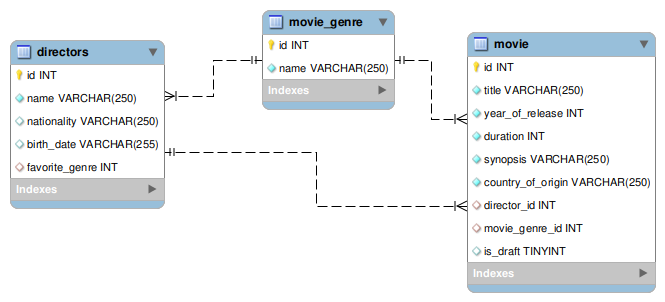

#  🎬 Cine Memory - Site de de Gerenciamento de Filmes 


## 🌐 [](https://github.com/SamuelRocha91/rails_movies_catalog/blob/main/README.md) [](https://github.com/SamuelRocha91/rails_movies_catalog/blob/main/README_es.md) [](https://github.com/SamuelRocha91/rails_movies_catalog/blob/main/README_en.md) [](https://github.com/SamuelRocha91/rails_movies_catalog/blob/main/README_ru.md) [](https://github.com/SamuelRocha91/rails_movies_catalog/blob/main/README_ch.md) [](https://github.com/SamuelRocha91/rails_movies_catalog/blob/main/README_ar.md)


## Visão Geral

Este projeto é um **Sistema de Gerenciamento de Filmes** desenvolvido com Ruby on Rails. Ele permite que os usuários gerenciem filmes, gêneros e diretores. Atualmente, o sistema está em **desenvolvimento ativo**, e o foco principal é oferecer uma solução completa para o gerenciamento de filmes com funcionalidades de CRUD (Criar, Ler, Atualizar, Deletar) e upload de imagens de banners dos filmes.

## Status do Projeto

⚠️ **Em desenvolvimento**: Este é um projeto em estágio inicial, e várias funcionalidades ainda estão em processo de implementação. Alterações e melhorias estão sendo feitas, então o sistema ainda não está completo.

## Estrutura do banco de dados



## Gems Utilizadas
- Bullet (Detecção de N+1 Queries)
Durante o desenvolvimento, a gem Bullet é usada para detectar e alertar sobre ineficiências no carregamento de consultas SQL, como o problema de N+1 queries.
- Kaminari (Paginação)
A gem Kaminari é utilizada para a paginação de registros em listagens, tornando a navegação em grandes conjuntos de dados mais eficiente. 
- Active Storage (Gerenciamento de Arquivos)
A aplicação também utiliza o Active Storage para fazer upload e gerenciamento de arquivos, como banners de filmes.

## Funcionalidades (Planejadas)

- **Gerenciamento de filmes**: 
  - Título
  - Ano de lançamento
  - Duração
  - Sinopse
  - País de origem
  - Upload de banners
  - Status de rascunho (Indica se o filme está em rascunho ou publicado)

- **Gerenciamento de gêneros de filmes**: Associar filmes a seus respectivos gêneros.

- **Gerenciamento de diretores**: 
  - Nome
  - Nacionalidade
  - Data de nascimento
  - Gênero favorito

## Instalação

1. Clone o repositório:
   ```bash
   git clone <repository_url>
   ```

2. Acesse o diretório do projeto:
   ```bash
   cd sistema-gerenciamento-filmes
   ```

3. Instale as dependências:
   ```bash
   bundle install
   ```

4. Configure o banco de dados:
   ```bash
   rails db:create
   rails db:migrate
   ```

5. Execute a aplicação:
   ```bash
   rails server
   ```
