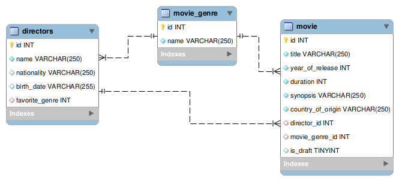

 🬠Cine Memory - 电影管理系统 

## 🌠[](https://github.com/SamuelRocha91/rails_movies_catalog/blob/main/README.md) [](https://github.com/SamuelRocha91/rails_movies_catalog/blob/main/README_es.md) [](https://github.com/SamuelRocha91/rails_movies_catalog/blob/main/README_en.md) [](https://github.com/SamuelRocha91/rails_movies_catalog/blob/main/README_ru.md) [](https://github.com/SamuelRocha91/rails_movies_catalog/blob/main/README_ch.md) [](https://github.com/SamuelRocha91/rails_movies_catalog/blob/main/README_ar.md)


<details>

<summary> <h2>概述</h2> </summary>

该项目是一个 **电影管理系统**，使用 Ruby on Rails 开发。它允许用户管理电影、类型和导演。应用了 CRUD（创建、读取、更新、删除）实体，并允许上传电影横幅的图像。

</details>

<details>

<summary> <h2>数据库结构</h2> </summary>



</details>

<details>

<summary> <h2>使用的 Gems</h2> </summary>

- Bullet（N+1 查询检测）  
在开发过程中，使用 Bullet gem 检测并警告 SQL 查询加载中的低效，例如 N+1 查询问题。

- Kaminari（分页）  
Kaminari gem 用于在列表中对记录进行分页，使在大数据集中的导航更加高效。

- Active Storage（文件管理）  
该应用程序还使用 Active Storage 上传和管理文件，例如电影横幅。

</details>

<details>

<summary> <h2>项目设置</h2> </summary>

  <details>

<summary> <h2>使用 Docker</h2> </summary>

要使用 Docker 运行此项目，请按照以下步骤操作：

#### 先决条件

确保您的计算机上安装了 Docker 和 Docker Compose。

- [Docker](https://docs.docker.com/get-docker/)  
- [Docker Compose](https://docs.docker.com/compose/install/)

#### 设置

1. 克隆相关存储库：

```
   git clone git@github.com:SamuelRocha91/rails_movies_catalog.git
   ```

2. 进入项目文件夹：

```
   cd rails_movies_catalog
   ```

3. 运行 Docker 命令：

```
   docker-compose up
   ```

4. 在浏览器中访问：

```
   http://0.0.0.0:3000/
   ```

  </details>
  
  <details>

<summary>  <h2>不使用 Docker</h2> </summary>

1. 克隆存储库：
   ```bash
   git clone git@github.com:SamuelRocha91/rails_movies_catalog.git
   ```

2. 访问项目目录：
   ```bash
   cd rails_movies_catalog
   ```

3. 安装依赖项：
   ```bash
   bundle install
   ```

4. 配置数据库：
   ```bash
   rails db:create
   rails db:migrate
   rails db:seed
   ```

5. 运行应用程序：
   ```bash
   rails server
   ```
   </details>

</details>

<details>

<summary> <h2>功能（计划中）</h2> </summary>

- **电影管理**： 
  - 单元测试
  - 响应式设计

</details>
<details>
  <summary><h2>🔗 Outros Repositórios</h2></summary>

  - ⚡ [Odin Projects](https://github.com/SamuelRocha91/ruby_exercises/blob/main/README_ch.md)

</details>